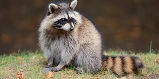

<html>
  <head>
<link rel="stylesheet" href="style.css">
  </head>
  <body>
<h1> Hello, this is the little website place I got from the help of GitHub </h1>

 I'm still new to coding and these kinds of things, so don't judge too much, anyway here's a picture of a raccoon 

    
 Other than that, I wanted to tell you How grateful I am to be doing all this, and as a result, I want to see if this button will work at the bottom of this sentence, go ahead and click on it.

    <button> <a href="https://www.youtube.com/watch?v=oHg5SJYRHA0"> Click Me Please </a> </button>
  </body>
</html>
